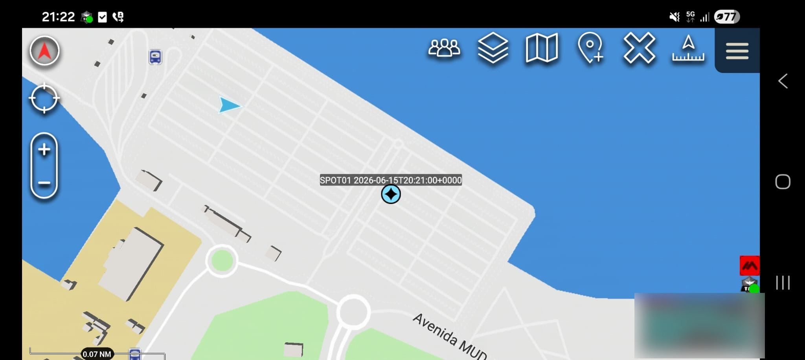

   

     
   

Spot-xTak was developed to work as a simplified version of a gateway bridging Globalstar™ products (SPOT Satellite Messengers) and TAK (Team Awareness Kit) End User Devices.

It operates by repeatedly checking (on configurable intervals) the SPOT satellite tracker's web feed for the latest GPS location of each device, then sends those positions as map markers to a TAK Server so they show up as pins on a tactical map.

# Getting Started

  
    $ git clone https://github.com/MIL-VUS-WORKS/Spot-xTak.git
    $ cd Spot-xTak
    $ pip install -r requirements.txt

1. Login to your spot account https://myaccount.findmespot.com/login
2. Create an XML Feed for your devices
3. View Details - Copy XML Feed ID
4. Paste the XML Feed ID in the spot_feed_id.txt
5. Set the parameters by editing the config.ini
6. Run $python3 spot-xtak.py
 
   

     
   

# Setting Parameters (config.ini)

| Parameter | Required | Default | Description |
|---|---|---|---|
| `SPOT_FEED_KEY_FILE` | Yes | `spot_feed_id.txt` | Path to a plain-text file containing **only** your SPOT shared-page feed ID (GLID). Relative paths resolve against the script's directory. |
| `SPOT_FEED_PASSWORD` | No | *(empty)* | Feed password, only needed if your SPOT shared page is password-protected. Sent as `?feedPassword=`. |
| `SPOT_POLL_INTERVAL` | No | `150` | Seconds between polls of the SPOT API. A minimum of `30` is enforced in code regardless of what you set. |
| `SPOT_COT_TYPE` | No | `a-f-G-E-S` | CoT type for the map pin. The default maps to *friendly / ground / equipment / sensor*. |
| `SPOT_COT_STALE` | No | *2× poll interval* | Seconds until a pin is marked stale on the map. Leave empty to auto-set to twice the poll interval. |
 
TAK Server destination
 
| Parameter | Required | Default | Description |
|---|---|---|---|
| `COT_URL` | Yes | *(none)* | TAK Server endpoint, e.g. `tls://192.168.1.177:8089`. Used by PyTAK to open the connection. |
 
TLS identity
 
| Parameter | Required | Default | Description |
|---|---|---|---|
| `PYTAK_TLS_CLIENT_CERT` | Yes (for TLS) | *(none)* | Path to the client certificate / keystore (`.p12` supported). |
| `PYTAK_TLS_CLIENT_PASSWORD` | No | *(empty)* | Password for the client cert / keystore. TAK's common default is `atakatak`. |
| `PYTAK_TLS_CLIENT_CAFILE` | Yes (for TLS) | *(none)* | Path to the CA / truststore. A `.p12`/`.pfx` truststore is auto-converted to PEM at runtime. |
| `PYTAK_TLS_TRUSTSTORE_PASSWORD` | No | *(empty)* | Password for the truststore. Falls back to `PYTAK_TLS_CLIENT_PASSWORD` if unset. |
| `PYTAK_TLS_DONT_VERIFY` | No | *(off)* | Set to `1` to skip TLS certificate verification. **Test / self-signed servers only — not for production.** |
| `PYTAK_TLS_DONT_CHECK_HOSTNAME` | No | *(off)* | Set to `1` to skip TLS hostname checking. **Test only.** |
 
Misc
 
| Parameter | Required | Default | Description |
|---|---|---|---|
| `DEBUG` | No | `False` | Set to `True` for verbose (`DEBUG`-level) logging. |

## Author
 
Developed by **MIL / VUS Works** — <https://milvusworks.com>

# Disclaimer

This is an independent, unofficial project. It is not affiliated with,
endorsed by, or sponsored by Globalstar, Inc. or the TAK Product Center.

SPOT is a registered trademark of Globalstar, Inc. — "SPOT is Copyright ©
2026 Globalstar®. All rights reserved." This project merely consumes the
publicly available SPOT shared-page XML feed and is not a Globalstar product.

ATAK / TAK and related marks belong to their respective owners. All other
trademarks are the property of their respective owners and are used here
for identification purposes only.

This software is provided "AS IS", without warranty of any kind. You are
responsible for complying with the SPOT API terms of service and any
applicable licenses when using this tool.

   

